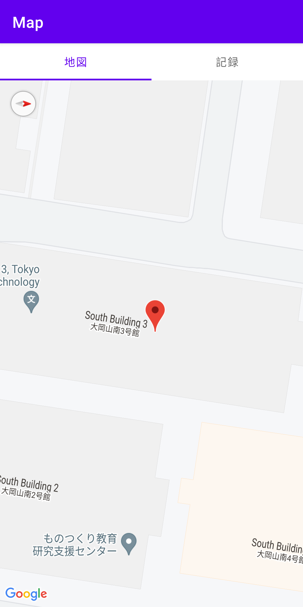

# 入退室管理アプリ
コロナの影響でどの講義室にどれくら滞在したかの提出を求められる昨今、いちいち手で記録するのは面倒ですね。
せっかくなのでアプリの位置情報を使って自動で記録してもらおうという魂胆です。
これがあれば面倒な手続きもそれなりに簡単になるはず！

## 使い方
1. マーカーを設置して場所を登録
    

1. 後は自動で入退室が管理されるので見るだけでOK(画像はイメージです)
    